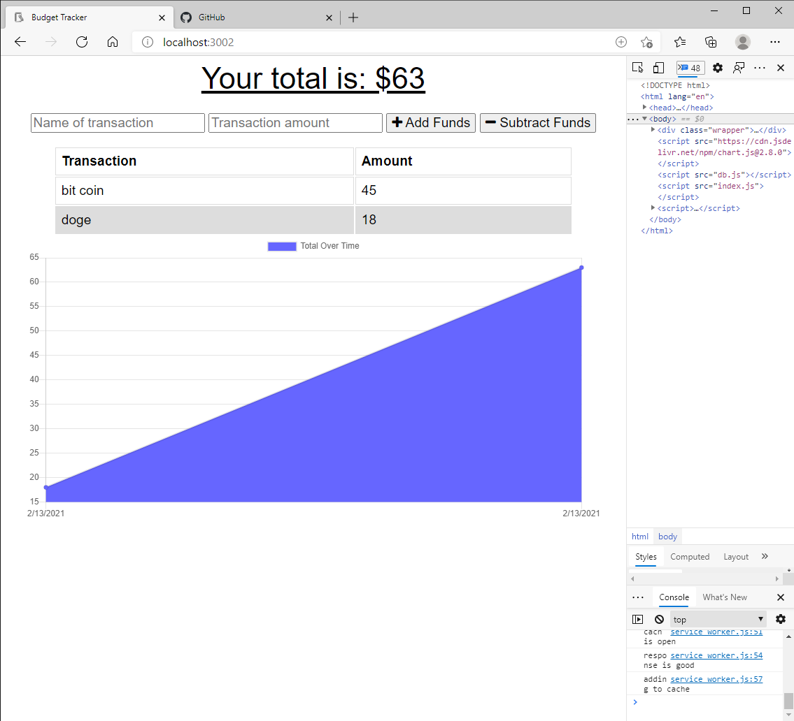

# PWA_Budget_Tracker

# Description

This is my first PWA project. It was somewhat challenging I am still having issues with atlas working on the deployed application but if you install and run on a local host it should work fine.

# Usage

This is a simple budget tracker where the user can add and delete items to there budget and the app will display a corresponding graph to show you how you are spending money. This will also work in offline mode just incase you dont have internet

# Tech Used

- Node.js
- Express.js
- Indexed.db
- service worker/manifest.json
- mongo.db/Heroku
- compression
- morgan

# Contact

if you would like to reach out feel free to contact me through the email on my github.

# ScreenShot

# Link to deployed Heroku App

[Click Here]() to access deployed heroku app.
